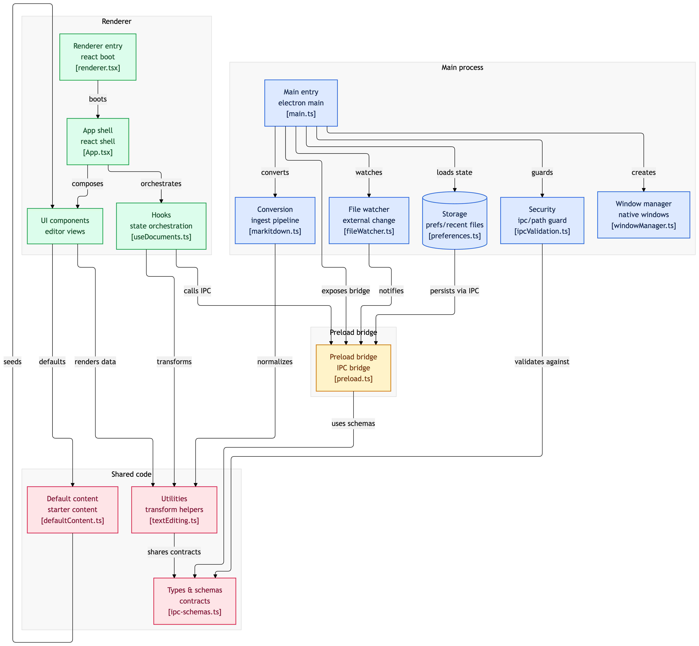

# Markdown Viewer

<div align="center">


**The Markdown viewer that opens everything else too.**

</div>

mdviewer is a fast, offline-first Markdown viewer and editor for macOS. Drop in a PDF, a Word doc, a spreadsheet, a web page, an e-book, a voice memo, an MP4 recording — mdviewer reads it back to you as clean Markdown. No round trips to a browser, no copy/paste from a preview pane, no more fumbling with format-specific apps just to grab a paragraph.

Built on Electron, React 19, and TypeScript 5 with a sandboxed renderer, Zod-validated IPC, and 434 automated tests.

## Drop-in Transcription for Audio and Video

Drag a WAV, MP3, M4A, or MP4 file onto the window and mdviewer returns a Markdown transcript. No separate tool, no web upload, no conversion pipeline — it's the same workflow as opening a PDF.

Use it to:

- Turn a voice memo into notes you can edit and save
- Pull quotes and action items out of a recorded meeting
- Capture audio diaries or podcast segments as searchable text
- Extract dialogue from an MP4 screen recording without ever leaving the app

Transcription uses Google's Web Speech API under the hood (the one browsers use for dictation). It's free, requires internet, and is the only outbound request mdviewer ever makes — everything else runs locally.

## Why mdviewer

**One window for every document you open.** Drag a vendor RFP onto the app and read the PDF as Markdown. Paste a URL's downloaded HTML and get structured content without the ads. Dump a quarterly XLSX and walk through the tables in your own typography. Drop an MP3 voice memo or MP4 screen capture and get back a transcript.

**Five view modes, one file.** Rendered for reading, Raw for editing, Split for live preview, Text for grep-friendly plain text, and a dedicated Mermaid diagram window for architecture sketches.

**Markdown-first, everything else is gravy.** `.md` files open instantly and work entirely offline. Non-Markdown conversion runs through [microsoft/markitdown](https://github.com/microsoft/markitdown); if it's not installed, you get a helpful install dialog instead of a silent failure.

## Supported Formats

| Category | Extensions |
|----------|-----------|
| **Markdown** (native, zero dependencies) | `.md`, `.markdown` |
| **Documents** | `.pdf`, `.docx`, `.pptx`, `.xlsx`, `.epub`, `.rtf` |
| **Web & Data** | `.html`, `.htm`, `.csv`, `.json`, `.xml` |
| **Plain Text** | `.txt`, `.rst` |
| **Images** (OCR + metadata) | `.jpg`, `.jpeg`, `.png`, `.gif`, `.webp`, `.tiff`, `.bmp` |
| **Audio & Video** (transcription via Google Speech API) | `.wav`, `.mp3`, `.m4a`, `.mp4` |
| **Archives** | `.zip` |

## Features

### Reading & Editing
- Multi-tab with drag-to-spawn new windows
- Four view modes: Rendered, Raw, Split (side-by-side), Text (plain)
- GitHub Flavored Markdown: tables, task lists, strikethrough
- Syntax highlighting across 180+ languages
- Mermaid diagrams with adaptive-contrast nodes and a zoomable window
- Synchronized selection highlighting in Split mode
- Find & Replace with case-sensitive search and bulk replace
- Formatting toolbar: headings, bold, italic, lists, code, quotes, links
- Read Aloud: native macOS narration that skips URLs, code blocks, and ASCII tables. Voice/rate picker, pause/resume, per-tab scoping, sentence and chapter navigation, and synchronized paragraph highlighting in Rendered view
- Custom undo/redo history, unsaved-change indicators, word count goals, reading-time estimate

### Themes
- System, Light, Dark, Solarized Light, Solarized Dark
- System mode follows macOS appearance in real time

### Files & Images
- Save as Markdown, PDF, or Text
- Drag-drop images to embed (auto-copied to `./images/` with relative paths)
- Recent files menu (last 50, full paths)
- macOS file associations across every supported extension

### Privacy & Security
- No telemetry, no analytics, no background network calls
- Audio transcription is the only outbound request and only runs when you open an audio file
- Sandboxed renderer, context isolation, strict CSP, Zod-validated IPC
- See [docs/SECURITY-MODEL.md](./docs/SECURITY-MODEL.md) for the full threat model

### Keyboard Shortcuts

| Shortcut | Action |
|----------|--------|
| `Cmd+N` | New document |
| `Cmd+O` | Open file dialog |
| `Cmd+S` | Save As |
| `Cmd+W` | Close tab |
| `Cmd+F` | Find & Replace |
| `Cmd+B` | Bold |
| `Cmd+I` | Italic |
| `Cmd+E` | Cycle view modes (Rendered → Raw → Split → Text) |
| `Cmd+T` | Cycle themes |
| `Cmd+Alt+W` | Toggle word wrap |
| `Cmd+Z` | Undo |
| `Cmd+Shift+Z` / `Cmd+Y` | Redo |
| `Cmd+Shift+R` | Start / pause / resume reading |
| `Cmd+Shift+.` | Stop reading |
| `Cmd+Shift+→` / `Cmd+Shift+←` | Next / previous sentence while reading |
| `Cmd+Shift+]` / `Cmd+Shift+[` | Next / previous chapter while reading |
| `Cmd+Alt+Shift+R` | Read from cursor (Raw or Split view) |

## Installation

### From Source

```bash
git clone https://github.com/jwtor7/mdviewer.git
cd mdviewer
npm install
npm start
```

`npm install` runs `scripts/setup-venv.sh` via `postinstall` to create a Python venv at `.venv/` and install `markitdown[all]`. It uses `uv` if available, otherwise falls back to `python -m venv` + pip. Recreate with `npm run setup:venv` if the venv gets stale.

**Requirements**: macOS, Node 20+, and either [`uv`](https://docs.astral.sh/uv/) (recommended) or Python 3.10+.

### Build & Install the Production App

```bash
./scripts/Install\ mdviewer.command
```

This script builds a release, copies `mdviewer.app` into `/Applications`, and registers macOS file associations for every supported format. Markdown files become the default; documents, images, and audio register as alternate viewers so they don't steal ownership from Preview, Word, or your existing tools.

**End-user runtime note**: the packaged `.app` does not bundle Python. For non-Markdown conversion to work outside your dev environment, end users need `markitdown` on their `PATH`:

```bash
uv tool install 'markitdown[all]'   # or: pipx install 'markitdown[all]'
```

For audio conversion specifically, `ffmpeg` also needs to be reachable (`brew install ffmpeg`). If anything is missing, mdviewer surfaces a targeted install dialog — Markdown files always work with zero runtime dependencies.

### Uninstalling

```bash
./scripts/Uninstall\ mdviewer.command
```

Removes `/Applications/mdviewer.app`, preferences, caches, saved state, and Application Support data.

## Development

```bash
npm start            # Dev server with hot reload
npm test             # Run the test suite
npm run test:watch   # Watch mode
npm run test:coverage
npm run typecheck    # tsc across all three processes
npm run lint
```

**Tech stack**: Electron 39, React 19, TypeScript 5, Vite, react-markdown, remark-gfm, rehype-highlight, mermaid.

**Test stack**: Vitest, React Testing Library, jsdom. Tests are co-located with source files (`Component.test.tsx`). 434 tests at time of writing.

**Testing file opening in dev**: the dev server doesn't register macOS file associations. Use `Cmd+O` or drag-and-drop. For real Launch Services testing, build a production `.app` via `npm run make` and install it.

## Architecture

```
src/
├── main.ts           Main process entry
├── preload.ts        Context-isolated IPC bridge
├── renderer.tsx      React entry
├── App.tsx           Application shell
├── main/             Modular main-process code
│   ├── security/     IPC validation, rate limiting, path validation
│   ├── storage/      Preferences, recent files
│   ├── markitdown.ts Conversion module + PATH resolution
│   ├── windowManager.ts
│   └── fileWatcher.ts
├── components/       MarkdownPreview, CodeEditor, MermaidDiagram, FindReplace, ...
├── hooks/            14 custom hooks (useDocuments, useTheme, useFileHandler, ...)
├── types/            Type definitions + Zod IPC schemas
├── utils/            Text stats, PDF rendering
└── constants/        Configuration values
```

**Security model**: sandboxed renderer with context isolation, all IPC handlers wrapped in Zod runtime validation, per-window rate limiting, path-traversal protection, URL allowlisting, and a strict Content Security Policy. Every inbound channel has a schema; every outbound URL runs through `validateExternalUrl`.

<details>
<summary>Architecture diagram</summary>



</details>

## Changelog

Recent releases below. Full history in [CHANGELOG.md](./CHANGELOG.md).

- **v5.2.2** — External-save auto-reload no longer steals focus or shows a spurious dirty-reload dialog; `app.on('open-file')` short-circuits when the file is already watched, and the confirm prompt is suppressed when on-disk content matches the last saved baseline
- **v5.2.1** — Public-repo hygiene: scrubbed leaked usernames, derived install paths from script location, added PII/credential scan script with husky pre-commit hook and CI workflow
- **v5.2.0** — Read-aloud narration via macOS `say` with visible transport controls (prev/next sentence and chapter), live rate/voice updates mid-utterance, per-tab chapter list, and Read-from-cursor

## Contributing

Issues and pull requests are welcome. Before opening a PR, read [docs/REPO-HYGIENE.md](docs/REPO-HYGIENE.md) for the rules on what doesn't belong in commits (absolute home paths, local agent state, secrets) and how the pre-commit hook and CI workflow enforce them.

## License

MIT — see [LICENSE](LICENSE).

## Author

**Junior Williams**

[](https://ca.linkedin.com/in/juniorw)
[](https://www.youtube.com/@jr.trustcyber)
[](https://substack.com/@trustcyber)
[](https://x.com/TrustCyberJR)

## Acknowledgments

- [Electron](https://www.electronjs.org/) for the runtime
- [React](https://react.dev/) for the UI
- [react-markdown](https://github.com/remarkjs/react-markdown) for rendering
- [react-syntax-highlighter](https://github.com/react-syntax-highlighter/react-syntax-highlighter) for code blocks
- [microsoft/markitdown](https://github.com/microsoft/markitdown) for universal document conversion
- [mermaid](https://mermaid.js.org/) for diagrams
